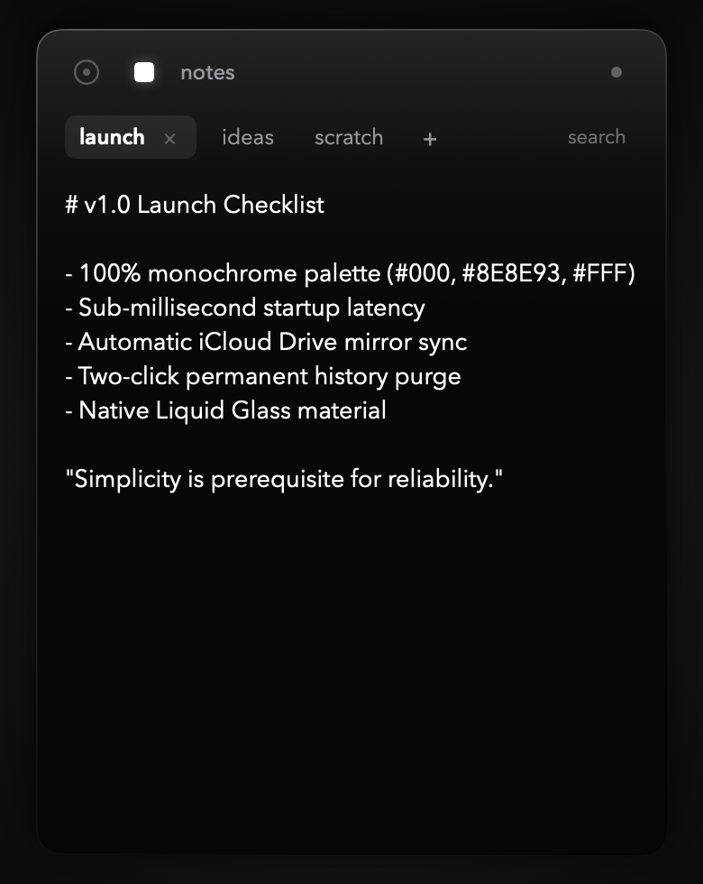

<div align="center">

# DOTO

### as minimal as possible todo app for macos bar

[](https://github.com/lowgame/doto/releases/latest)
[](https://github.com/lowgame/doto)
[](https://swift.org)
[](LICENSE)

<br/>

<p align="center">
  
  
  
</p>

*Strictly 3 colors. Zero icons. Zero clutter. Pure typographic geometry.*

</div>

---

## Philosophy & Theoretical Foundations

> *"Perfection is achieved, not when there is nothing more to add, but when there is nothing left to take away."*  
> — **Antoine de Saint-Exupéry**, *Terre des hommes* (1939)

Most productivity tools suffer from creeping feature bloat, complex project taxonomies, colorful badges, and cognitive friction. **DOTO** is designed from first principles as an exercise in radical design reduction, grounded in established human-computer interaction (HCI), graphic design, and cognitive psychology theory:

### 1. "Less, but better" (*Weniger, aber besser*)
> *"Good design is as little design as possible. Less, but better – because it concentrates on the essential aspects, and the products are not burdened with non-essentials. Back to purity, back to simplicity."*  
> — **Dieter Rams**, *Ten Principles for Good Design* (1976)

- **Implementation**: DOTO strips away project trees, color pickers, priority tags, and avatar badges. The interface concentrates strictly on what matters: entering a thought, tracking an active obligation, preserving daily habits, or scribbling notes.

### 2. The Data-Ink Ratio
> *"A large share of ink on a graphic should present data-information... Above all else show the data. Maximize the data-ink ratio; erase non-data-ink, within reason."*  
> — **Edward R. Tufte**, *The Visual Display of Quantitative Information* (1983)

- **Implementation**: Every pixel in DOTO serves functional communication:
  - Zero decorative borders, dividers, or background boxes.
  - Interactive dots communicate state (pending, repeating, completed) without supplemental icons or decorative chrome.
  - Due indicators (`due in 2`) appear only when scheduled, using pure typography rather than colorful badges.

### 3. The Discipline of the Grid & Semantic Hierarchy
> *"The grid represents the basic currency of design. It is a visual program that creates order, intellectual elegance, and visual harmony."*  
> — **Massimo Vignelli**, *The Vignelli Canon* (2010)

- **Implementation**:
  - **Single Vertical Axis**: Every interactive dot across every view (tasks, history, repeat circles, notes tab button) is locked to the exact horizontal coordinate of `X = 28.0px`.
  - **Unified Baseline**: All typography initiates on the exact vertical line `X = 50.0px`.
  - **Chromatic Restraint**: Strict reliance on a timeless, functional triad: Black (`#000000`), Grey (`#8E8E93`), and White (`#FFFFFF`). Zero arbitrary accent colors.

### 4. Gestalt Psychology: Prägnanz & Spatial Proximity
> *"The law of Prägnanz asserts that the human mind naturally organizes sensory stimuli into the simplest, most stable and economical configuration possible."*  
> — **Max Wertheimer**, *Laws of Organization in Perceptual Forms* (1923)

- **Implementation**: Instead of separating items with heavy horizontal rules or enclosed cards, groupings and hierarchies are established solely through typographic weight, subtle luminosity, and calibrated whitespace (Gestalt Law of Proximity).

### 5. Reduction of Cognitive Friction (Hick's Law & Cognitive Load)
> *"Reaction time is a logarithmic function of the number of alternatives: \( T = b \cdot \log_2(n + 1) \). Minimizing extraneous cognitive load preserves working memory for the user's primary task."*  
> — **William E. Hick** (1952) / **John Sweller** (1988)

- **Implementation**:
  - **Mutually Exclusive Controls**: `repeat` and `due` are strictly mutually exclusive—eliminating invalid scheduling states.
  - **Zero Modal Interruptions**: Deletion history uses a seamless two-click in-place confirmation (`×` primes and turns bold; second click purges) rather than jarring "Are you sure?" modal dialogs.
  - **Sub-millisecond Latency**: Resident menu bar daemon summons instantly with zero network roundtrips or loading spinners (Maeda's 3rd Law of Simplicity: *"Savings in time feel like simplicity"*).

---

## Features

- **Menu Bar Resident**: Sits quietly in your macOS status bar. Click the status dot or use your preferred workflow to summon it.
- **Habits & Tasks**:
  - Regular one-off tasks.
  - **Repeat tasks**: Automatically reset to uncompleted at midnight (00:00) every day for persistent daily habits.
  - **Due dates**: Set deadlines in 1 to 5 days. Repeat and due date options are strictly mutually exclusive.
- **Tabbed Scratchpad & Notes**:
  - Click the square icon (`■`) in the top bar to switch to notes.
  - Unlimited horizontal tabs with inline click-to-rename tab titles.
  - Native AppKit text engine with high-precision typographic alignment and custom monochrome caret (zero blue).
  - **Cross-Note Search (`⌘F`)**: Real-time filtering matching note titles and body content across all tabs.
- **Zero-Modal History Purge**:
  - Click the concentric dot (`◎`) to view completed and dismissed history.
  - Tap `×` once to prime for deletion (the `×` turns bold white/black); tap a second time to permanently purge. Zero dialogs, zero "Are you sure?" popups.
- **Native Keyboard Navigation**:
  - `⌘A` (Select All), `⌘C` (Copy), `⌘V` (Paste), `⌘X` (Cut), `⌘Z` (Undo), `⌘⇧Z` (Redo) fully supported across all fields.
  - `⌘F` to search notes, `esc` to close search.
- **Offline-First with iCloud Sync**:
  - Stores data locally in `~/Library/Application Support/doto/` for instantaneous offline launch.
  - Automatically mirrors atomic JSON files to `~/Library/Mobile Documents/com~apple~CloudDocs/doto/` for effortless cross-Mac syncing with your existing Apple ID.

---

## Installation

### Pre-built DMG (Recommended)

1. Download the latest **[doto.dmg](https://github.com/lowgame/doto/releases/latest)** from the Releases page.
2. Open `doto.dmg` and drag **doto.app** to your **Applications** folder.
3. Launch **doto**. A minimalist dot will appear in your menu bar.

> **Note on Gatekeeper**: Because this app is self-built without a paid Apple Developer certificate, macOS might show a warning on first launch. Simply right-click (or Control-click) `doto.app` in `/Applications` and select **Open**.

---

## Building from Source

Requirements:
- macOS Sonoma 14.0 or newer
- Xcode 15+ / Swift 5.10+ command line tools

```bash
# Clone the repository
git clone https://github.com/lowgame/doto.git
cd doto

# Build release bundle and DMG installer
./Scripts/create_dmg.sh

# The ready-to-use bundle is in build/doto.app and installer in build/doto.dmg
open build/doto.dmg
```

---

## Architecture

```
doto/
├── Sources/
│   ├── Doto/                      # Menu bar entry point (NSApplicationDelegate)
│   └── DotoCore/
│       ├── Models/                # TaskItem, NoteItem
│       ├── Services/              # TaskManager, NoteManager, NotificationManager
│       ├── Shaders/               # InkShaders.metal (luminous bloom & ripple)
│       ├── Views/
│       │   ├── Components/        # MinimalTextEditor, TaskRow, TaskInput, NotesView
│       │   └── DotoPopoverView.swift
│       └── Windows/               # DotoPanelController (NSPanel & status item)
├── Tests/DotoTests/               # Full XCTest suite (15 unit tests)
├── Scripts/
│   ├── build_app.sh               # Metal compilation & release bundle assembly
│   └── create_dmg.sh              # DMG packaging
└── assets/                        # High-resolution screenshots
```

---

## References & Literature

1. **Rams, Dieter** (1976). *Ten Principles for Good Design*. Braun AG.
2. **Tufte, Edward R.** (1983). *The Visual Display of Quantitative Information*. Cheshire, CT: Graphics Press.
3. **Vignelli, Massimo** (2010). *The Vignelli Canon*. Zürich: Lars Müller Publishers.
4. **Maeda, John** (2006). *The Laws of Simplicity: Design, Technology, Business, Life*. Cambridge, MA: MIT Press.
5. **Wertheimer, Max** (1923). *Untersuchungen zur Lehre von der Gestalt II*. Psychologische Forschung, 4(1), 301–350.
6. **Hick, William E.** (1952). *On the rate of gain of information*. Quarterly Journal of Experimental Psychology, 4(1), 11–26.
7. **Sweller, John** (1988). *Cognitive load during problem solving: Effects on learning*. Cognitive Science, 12(2), 257–285.
8. **Saint-Exupéry, Antoine de** (1939). *Terre des hommes*. Paris: Éditions Gallimard.

---

## License

Released under the [MIT License](LICENSE). Created by [Ahmet Kamer (@lowgame)](https://github.com/lowgame).
