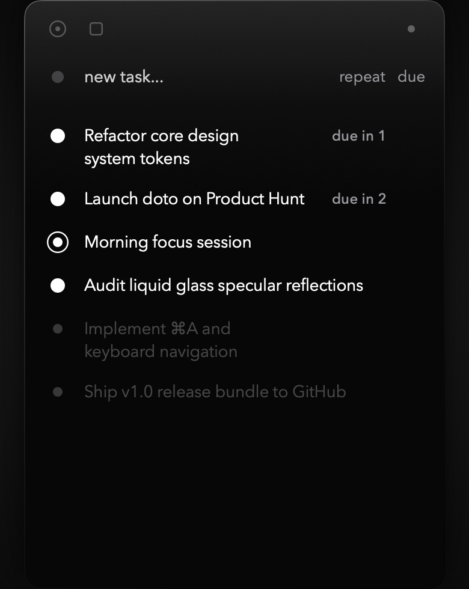
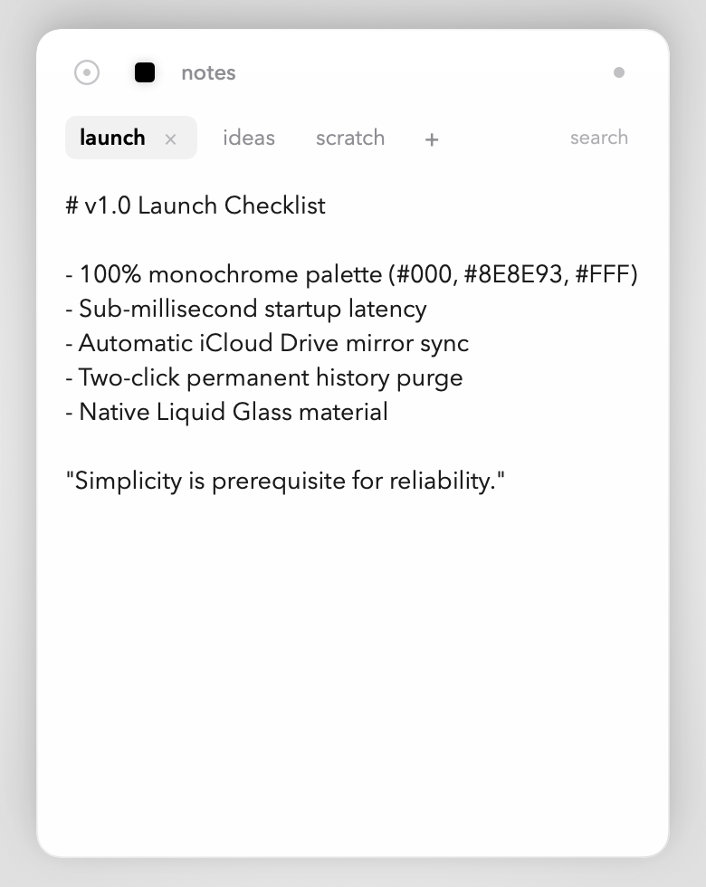

<div align="center">

# DOTO

### as minimal as possible todo app for macos bar

[](https://github.com/lowgame/doto/releases/latest)
[](https://github.com/lowgame/doto)
[](https://swift.org)
[](LICENSE)
[](https://x.com/hiimthelowgame)

<br/>

<p align="center">
  
  
  
</p>

*Strictly 3 colors. Zero icons. Zero clutter. Pure typographic geometry.*

</div>

---

## Philosophy & Design Principles

Most productivity tools suffer from feature bloat, complex project hierarchies, colorful tags, and cognitive friction. **DOTO** strips away everything non-essential:

- **Strictly 3 Colors**: Black (`#000000`), Grey (`#8E8E93`), and White (`#FFFFFF`). Zero arbitrary accent colors.
- **Pixel-Perfect 1:1 Geometry**: Every interactive dot is centered on a single `28.0px` X-axis. All typography aligns on a shared `50.0px` vertical baseline.
- **Data-Pixel Purity**: Every pixel communicates functional state. Zero decorative borders, dividing rules, or ornamental containers.
- **Liquid Glass Aesthetic**: Native macOS `.ultraThinMaterial` with specular reflections and subtle rim lighting that adapts to dark and light backgrounds.
- **Mutual Exclusivity**: `repeat` (daily habits) and `due` (deadlines) are strictly mutually exclusive—eliminating invalid scheduling states.
- **Zero-Modal Friction**: Two-click in-place deletion (`×` primes and purges), eliminating intrusive confirmation popups.
- **Featherweight Native Performance**: Under 1 MB binary size built with 100% native Swift, SwiftUI, AppKit, and Metal with sub-millisecond resident launch.

---

## Features

- **Menu Bar Resident**: Sits quietly in your macOS status bar. Click the status dot or use your preferred workflow to summon it.
- **Habits & Tasks**:
  - Regular one-off tasks.
  - **Repeat tasks**: Automatically reset to uncompleted at midnight (00:00) every day for persistent daily habits.
  - **Due dates**: Set deadlines in 1 to 5 days. Repeat and due date options are strictly mutually exclusive.
- **Tabbed Scratchpad & Notes**:
  - Click the square icon (`■`) in the top bar to switch to notes.
  - Unlimited horizontal tabs with inline click-to-rename tab titles.
  - Native AppKit text engine with high-precision typographic alignment and custom monochrome caret (zero blue).
  - **Cross-Note Search (`⌘F`)**: Real-time filtering matching note titles and body content across all tabs.
- **Zero-Modal History Purge**:
  - Click the concentric dot (`◎`) to view completed and dismissed history.
  - Tap `×` once to prime for deletion (the `×` turns bold white/black); tap a second time to permanently purge. Zero dialogs, zero "Are you sure?" popups.
- **Native Keyboard Navigation**:
  - `⌘A` (Select All), `⌘C` (Copy), `⌘V` (Paste), `⌘X` (Cut), `⌘Z` (Undo), `⌘⇧Z` (Redo) fully supported across all fields.
  - `⌘F` to search notes, `esc` to close search.
- **Offline-First with iCloud Sync**:
  - Stores data locally in `~/Library/Application Support/doto/` for instantaneous offline launch.
  - Automatically mirrors atomic JSON files to `~/Library/Mobile Documents/com~apple~CloudDocs/doto/` for effortless cross-Mac syncing with your existing Apple ID.

---

## Installation

### Pre-built DMG (Recommended)

1. Download the latest **[doto.dmg](https://github.com/lowgame/doto/releases/latest)** from the Releases page.
2. Open `doto.dmg` and drag **doto.app** to your **Applications** folder.
3. Launch **doto**. A minimalist dot will appear in your menu bar.

> **Note on Gatekeeper**: Because this app is self-built without a paid Apple Developer certificate, macOS might show a warning on first launch. Simply right-click (or Control-click) `doto.app` in `/Applications` and select **Open**.

---

## Building from Source

Requirements:
- macOS Sonoma 14.0 or newer
- Xcode 15+ / Swift 5.10+ command line tools

```bash
# Clone the repository
git clone https://github.com/lowgame/doto.git
cd doto

# Build release bundle and DMG installer
./Scripts/create_dmg.sh

# The ready-to-use bundle is in build/doto.app and installer in build/doto.dmg
open build/doto.dmg
```

---

## Architecture

```
doto/
├── Sources/
│   ├── Doto/                      # Menu bar entry point (NSApplicationDelegate)
│   └── DotoCore/
│       ├── Models/                # TaskItem, NoteItem
│       ├── Services/              # TaskManager, NoteManager, NotificationManager
│       ├── Shaders/               # InkShaders.metal (luminous bloom & ripple)
│       ├── Views/
│       │   ├── Components/        # MinimalTextEditor, TaskRow, TaskInput, NotesView
│       │   └── DotoPopoverView.swift
│       └── Windows/               # DotoPanelController (NSPanel & status item)
├── Tests/DotoTests/               # Full XCTest suite (15 unit tests)
├── Scripts/
│   ├── build_app.sh               # Metal compilation & release bundle assembly
│   └── create_dmg.sh              # DMG packaging
└── assets/                        # High-resolution screenshots
```

---

## Author & License

Created by **Ahmet Kamer**  
- **X (Twitter)**: [@hiimthelowgame](https://x.com/hiimthelowgame)  
- **GitHub**: [@lowgame](https://github.com/lowgame)  

Released under the [MIT License](LICENSE).
