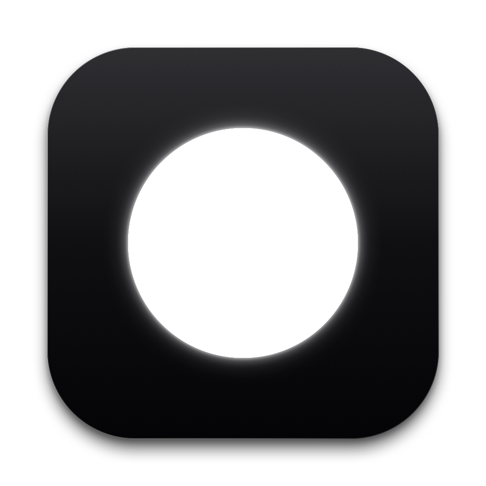

<div align="center">

# DOTO

### as minimal as possible todo app for macos bar

[](https://github.com/lowgame/doto/releases/latest)
[](https://github.com/lowgame/doto)
[](LICENSE)
[](https://x.com/hiimthelowgame)

<br/><br/>



<br/><br/>

<p align="center">
  
  
  
</p>

*Strictly 3 colors. Zero icons. Zero clutter. Pure typographic geometry.*

</div>

---

## Design Principles

- **Less, but better** ([Dieter Rams](https://www.vitsoe.com/us/about/good-design)): Zero project trees, priority tags, or avatar chrome. Only essential thoughts and habits.
- **Data-Ink Ratio** ([Edward Tufte](https://www.edwardtufte.com/books/)): Every pixel is state. Zero decorative borders, dividers, or background boxes.
- **Grid Discipline** ([Massimo Vignelli](https://archive.org/details/thevignellicanon)): All dots locked to `X = 28.0px`, text to `X = 50.0px`. Strictly `#000000`, `#8E8E93`, `#FFFFFF`.
- **Zero Friction** ([Hick's Law](https://doi.org/10.1080/17470215208416600)): Mutually exclusive `repeat` / `due`, two-click in-place `×` purge, sub-millisecond resident launch.

---

## Features

- **Menu Bar Resident**: Summon instantly from macOS status bar.
- **Habits & Tasks**: Daily 00:00 midnight reset for repeating tasks; 1..5 day due dates.
- **Tabbed Notes (`■`)**: Clean horizontal tabs, inline rename, native text engine, cross-note search (`⌘F`).
- **Two-Click Purge (`◎`)**: Click `×` once to prime, twice to permanently purge. Zero dialogs.
- **Shortcuts**: `⌘A`, `⌘C`, `⌘V`, `⌘X`, `⌘Z`, `⌘⇧Z`, `⌘F`, `esc`.
- **iCloud Sync**: Instant local launch from `~/Library/Application Support/doto/` with automatic iCloud Drive mirroring.
- **Featherweight**: Native Swift, SwiftUI, AppKit & Metal. Under 1 MB binary.

---

## Installation

Download **[doto.dmg](https://github.com/lowgame/doto/releases/latest)**, drag **doto.app** to `/Applications`, and open.

*(If macOS shows an unnotarized app prompt on first launch, right-click `doto.app` and select **Open**).*

```bash
# Or build from source
git clone https://github.com/lowgame/doto.git && cd doto && ./Scripts/create_dmg.sh
```

---

## Author & License

Created by **Ahmet Kamer** — [@hiimthelowgame](https://x.com/hiimthelowgame) on X · [@lowgame](https://github.com/lowgame) on GitHub.  
Released under the [MIT License](LICENSE).
